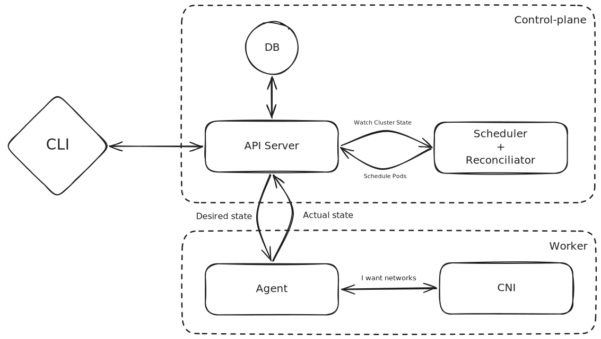

<div align="center">

# Barenetes

**A minimal Kubernetes implementation written in Rust**

[](https://www.rust-lang.org)
[](LICENSE)
[](https://github.com/do-2k25-28/Barenetes/issues)
[](https://github.com/do-2k25-28/Barenetes/pulls)
[](https://github.com/do-2k25-28/Barenetes/stargazers)

</div>

---

Barenetes is an open-source, reimplementation of the core Kubernetes control plane in Rust. The goal is to build a working, minimal container orchestrator from scratch.

> **Status:** Early development. Core components are being scaffolded. Not production-ready.

---

## Table of Contents

- [Overview](#overview)
- [Architecture](#architecture)
- [Components](#components)
- [Getting Started](#getting-started)
- [Building](#building)
- [Contributing](#contributing)
- [License](#license)
- [Star History](#star-history)

---

## Overview

Kubernetes is a powerful but complex system. Barenetes strips it down to its essential primitives, reimplementing them in safe, idiomatic Rust. The project is designed to be readable and approachable.

Key design principles:

- **Minimal** : only the core orchestration loop, no optional features
- **Transparent** : clear separation between components, explicit communication via gRPC
- **Safe** : Rust's type system and ownership model enforced throughout

---

## Architecture

<picture>
  <source media="(prefers-color-scheme: dark)" srcset="./docs/architectureOverview.dark.excalidraw.svg" />
  <source media="(prefers-color-scheme: light)" srcset="./docs/architectureOverview.light.excalidraw.svg" />
  
</picture>

---

## Components

Barenetes is a Cargo workspace composed of five crates, each mirroring a real Kubernetes component. All inter-component communication uses **gRPC / Protocol Buffers**.

| Crate                     | Equivalent     | Role                                                 |
| ------------------------- | -------------- | ---------------------------------------------------- |
| `agent`                   | kubelet        | Runs on each node, manages container lifecycle       |
| `api`                     | kube-apiserver | Central hub : accepts requests and coordinates state |
| `barectl`                 | kubectl        | CLI to interact with the API server                  |
| `scheduler/reconciliator` | kube-scheduler | Assigns workloads to nodes                           |
| `cni`                     | CNI plugin     | Manages pod networking                               |

Proto definitions live in `proto/<component>/v1/`.

---

## Getting Started

### Prerequisites

- [Rust](https://rustup.rs) (edition 2026 / nightly)
- [protoc](https://grpc.io/docs/protoc-installation/) : Protocol Buffer compiler

### Clone

```bash
git clone https://github.com/do-2k25-28/Barenetes.git
cd Barenetes
```

---

## Building

Build the entire workspace:

```bash
cargo build
```

Build a single component:

```bash
cargo build -p agent
cargo build -p api
cargo build -p barectl
cargo build -p scheduler
cargo build -p cni
```

Run a component:

```bash
cargo run -p api
```

---

## Contributing

Contributions are welcome. Please open an issue before submitting a pull request for non-trivial changes so we can discuss the approach first.

1. Fork the repository
2. Create a feature branch (`git checkout -b feat/my-feature`)
3. Commit your changes
4. Open a pull request

Please keep PRs focused : one feature or fix per PR.

---

## License

Distributed under the MIT License. See [`LICENSE`](LICENSE) for details.

---

## Star History

<div align="center">
  <a href="https://www.star-history.com/?type=date&repos=do-2k25-28%2FBarenetes">
    <picture>
      <source media="(prefers-color-scheme: dark)" srcset="https://api.star-history.com/chart?repos=do-2k25-28/Barenetes&type=date&theme=dark&legend=top-left" />
      <source media="(prefers-color-scheme: light)" srcset="https://api.star-history.com/chart?repos=do-2k25-28/Barenetes&type=date&legend=top-left" />
      
    </picture>
  </a>
</div>
