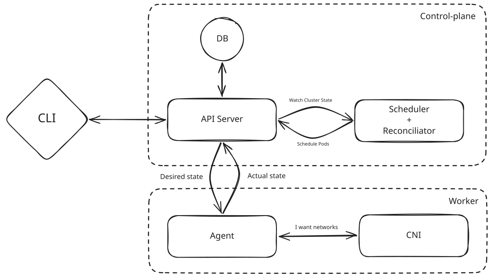

<div align="center">

# Barenetes

**A minimal Kubernetes implementation written in Rust**

[](https://www.rust-lang.org)
[](LICENSE)
[](https://github.com/do-2k25-28/Barenetes/issues)
[](https://github.com/do-2k25-28/Barenetes/pulls)
[](https://github.com/do-2k25-28/Barenetes/stargazers)

</div>

---

Barenetes is an open-source, reimplementation of the core Kubernetes control plane in Rust. The goal is to build a working, minimal container orchestrator from scratch.

> **Status:** Early development. Core components are being scaffolded. Not production-ready.

---

## Table of Contents

- [Barenetes](#barenetes)
  - [Table of Contents](#table-of-contents)
  - [Overview](#overview)
  - [Architecture](#architecture)
  - [Components](#components)
  - [Getting Started](#getting-started)
    - [Prerequisites](#prerequisites)
    - [Clone](#clone)
  - [Building](#building)
  - [Deploying](#deploying)
  - [Contributing](#contributing)
  - [License](#license)
  - [Star History](#star-history)

---

## Overview

Kubernetes is a powerful but complex system. Barenetes strips it down to its essential primitives, reimplementing them in safe, idiomatic Rust. The project is designed to be readable and approachable.

Key design principles:

- **Minimal** : only the core orchestration loop, no optional features
- **Transparent** : clear separation between components, explicit communication via gRPC
- **Safe** : Rust's type system and ownership model enforced throughout

---

## Architecture

<picture>
  <source media="(prefers-color-scheme: dark)" srcset="./docs/architectureOverview.dark.excalidraw.svg" />
  <source media="(prefers-color-scheme: light)" srcset="./docs/architectureOverview.light.excalidraw.svg" />
  
</picture>

---

## Components

Barenetes is a Cargo workspace composed of six crates, each mirroring a real Kubernetes component (`pki` has no direct equivalent; it's the cluster's own mTLS bootstrap tool). All inter-component communication uses **gRPC / Protocol Buffers**, secured with mutual TLS.

| Crate                     | Equivalent     | Role                                                 |
| ------------------------- | -------------- | ---------------------------------------------------- |
| `agent`                   | kubelet        | Runs on each node, manages container lifecycle       |
| `api`                     | kube-apiserver | Central hub : accepts requests and coordinates state |
| `barectl`                 | kubectl        | CLI to interact with the API server                  |
| `scheduler/reconciliator` | kube-scheduler | Assigns workloads to nodes                           |
| `cni`                     | CNI plugin     | Manages pod networking                               |
| `pki`                     | -              | Bootstraps the cluster's private mTLS CA and certs   |

Proto definitions live in `proto/<component>/v1/`.

---

## Getting Started

### Prerequisites

- [Rust](https://rustup.rs) (edition 2026 / nightly)
- [protoc](https://grpc.io/docs/protoc-installation/) : Protocol Buffer compiler

### Clone

```bash
git clone https://github.com/do-2k25-28/Barenetes.git
cd Barenetes
```

---

## Building

Build the entire workspace:

```bash
cargo build
```

Build a single component:

```bash
cargo build -p agent
cargo build -p api
cargo build -p barectl
cargo build -p scheduler
cargo build -p cni
cargo build -p pki
```

Run a component:

```bash
cargo run -p api
```

---

## Deploying

Every tagged release (`vX.Y.Z`) publishes all six binaries as GitHub Release
assets. `deploy/install.sh` installs them as systemd services on a control
plane and/or worker node, and always sets up a private mTLS CA for the
control plane's own services:

```sh
sudo ./deploy/install.sh --role control-plane                        # api + scheduler, mTLS by default
sudo ./deploy/install.sh --role worker --server https://<cp-ip>:50052 --node-name <name>   # cni + agent
sudo ./deploy/install.sh --role all --node-name <name>                # single-node setup
```

See [`deploy/README.md`](deploy/README.md) for options (etcd, multi-node CNI
overlay, mTLS/PKI, etc.) and current limitations.

---

## Contributing

Contributions are welcome. Please open an issue before submitting a pull request for non-trivial changes so we can discuss the approach first.

1. Fork the repository
2. Create a feature branch (`git checkout -b feat/my-feature`)
3. Commit your changes
4. Open a pull request

Please keep PRs focused : one feature or fix per PR.

---

## License

Distributed under the MIT License. See [`LICENSE`](LICENSE) for details.

---

## Star History

<a href="https://www.star-history.com/?repos=do-2k25-28%2FBarenetes&type=date&legend=bottom-right">
 <picture>
   <source media="(prefers-color-scheme: dark)" srcset="https://api.star-history.com/chart?repos=do-2k25-28/Barenetes&type=date&theme=dark&legend=bottom-right&sealed_token=xy3zkkEuGhtBRmDPSf48WOWyV35Mbvxa9Kc4uTwbxkXJHs5AGmQ-NcRcB9hNKCjdQJ5FhMd_QrXjB_tgvRBXg8cB0n6JPy7rtZWLyiURXpGaLBaf4yqUyg" />
   <source media="(prefers-color-scheme: light)" srcset="https://api.star-history.com/chart?repos=do-2k25-28/Barenetes&type=date&legend=bottom-right&sealed_token=xy3zkkEuGhtBRmDPSf48WOWyV35Mbvxa9Kc4uTwbxkXJHs5AGmQ-NcRcB9hNKCjdQJ5FhMd_QrXjB_tgvRBXg8cB0n6JPy7rtZWLyiURXpGaLBaf4yqUyg" />
   
 </picture>
</a>